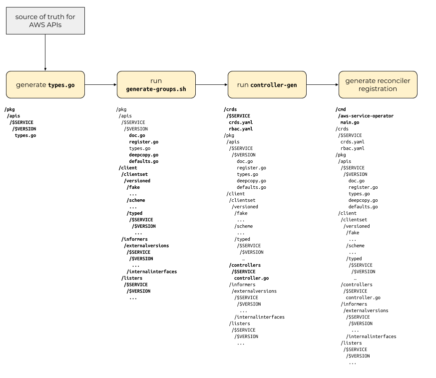

# Code generation

In order to keep the code for all the service controllers consistent, we will
use a strategy of generating the custom resource definitions and controller
code stubs for new AWS services.

To generate the CRDs and controller stub code, we investigated a number of
options:

* home-grown custom code generator
* [kudo](https://kudo.dev)
* [kubebuilder](github.com/kubernetes-sigs/kubebuilder)
* a hybrid custom code generator + sigs.kubernetes.io/controller-tools (CR)

The original AWS Service Operator used a [custom-built generator][1] that
processed [YAML manifests][2] describing the AWS service and used
[templates][3] to [generate CRDs][4], the [controller code][5] itself and the
[Go types][6] that represent the CRDs in memory. It's worth noting that the
CRDs *and* the controller code that was generated by the original ASO was very
tightly coupled to CloudFormation. In fact, the CRDs for individual AWS
services like S3 or RDS were thin wrappers around CloudFormation stacks that
described the object being operated upon.

[1]: https://github.com/amazon-archives/aws-service-operator/tree/master/code-generation
[2]: https://github.com/amazon-archives/aws-service-operator/tree/master/models
[3]: https://github.com/amazon-archives/aws-service-operator/tree/master/code-generation/pkg/codegen/assets
[4]: https://github.com/amazon-archives/aws-service-operator/blob/b4befd62322a57ac78aa39ea08771fc32912592a/code-generation/pkg/codegen/assets/aws-service-operator.yaml.templ#L13-L31
[5]: https://github.com/amazon-archives/aws-service-operator/blob/master/code-generation/pkg/codegen/assets/operator.go.templ
[6]: https://github.com/amazon-archives/aws-service-operator/blob/master/code-generation/pkg/codegen/assets/types.go.templ

kudo is a platform for building Kubernetes Operators. It stores state in its
own kudo.dev CRDs and allows users to define "plans" for a deployed application
to deploy itself. We determined that kudo was not a particularly good fit for
ASO for a couple reasons. First, we needed a way to generate CRDs in several
API groups (s3.aws.com and iam.aws.com for example) and the ASO controller code
isn't deploying an "application" that needs to have a controlled deployment
plan. Instead, ASO is a controller that facilitates creation and management of
various AWS service objects using Kubernetes CRD instances.

kubebuilder is the recommended upstream tool for generating CRDs and controller
stub code. It is a Go binary that creates the scaffolding for CRDs and
controller Go code. Unfortunately, it doesn't really handle multiple API groups
in the same source code repository, and we need that for ASO. For example, we
will have an `s3.service-operator.aws` and an `iam.service-operator.aws` API
group with CRDs representing those different API objects and interfaces.

That said, much of kubebuilder simply sets up some templates and then runs the
`controller-gen` binary from the sigs.kubernetes.io/controller-tools repository
to generate Go code.

Our final option was to build a hybrid custom code generator that used
controller-runtime under the hood but allowed us to generate controller stub
code for multiple API groups and place generated code [in directories][7] that
represented Go best practices. This option gives us the flexibility to generate
the files and content for multiple API groups but still stay within the
recommended guardrails of the upstream Kubernetes community.

[7]: https://github.com/kubernetes-sigs/kubebuilder/issues/1268

## Hybrid custom+controller-runtime proposal



This approach uses multiple phases of code generation.

The first code generation phase consumes model information from a canonical
source of truth about an AWS service and the objects and interfaces that
service exposes and generates one or more files containing code that exposes
Go types for those objects. These "type files" should be annotated with the
marker and comments that will allow the core code generators and controller-gen
to do its work.

Once we have generated the type files, we need to generate basic scaffolding
for consumers of those types. The upstream code-generator project contains
generators for this scaffolding. We should be able to make a modified version
of the upstream [`generate-groups.sh`][8] script to generate all the defaults,
deepcopy, informers, listers and clientset code.

[8]: https://github.com/kubernetes/code-generator/blob/6b257a9d6f461b5e15dc2f0d13e29731a5b5255a/generate-groups.sh

Next, we will need to generate some skeleton code for the reconciling
controller handling the new API along with the YAML files representing the CRDs
that will get loaded into kube-apiserver and the YAML files for RBAC and
OpenAPI v3 schemas for the CRDs. This is where the [`controller-gen`][9] tool
from the sigs.kubernetes.io/controller-tools project will come in handy.

[9]: https://github.com/kubernetes-sigs/controller-tools/blob/a5fa7b956b85a6e792bc7086fedf7107d62452b1/cmd/controller-gen/main.go

We also want to generate some stub code for a new reconciling controller into
the primary aws-service-operator binary.

When we run `make generate $SERVICE $VERSION`, we should end up with a directory
structure like this:

```
/cmd
 /aws-service-operator
  main.go
/crds
 /$SERVICE
  crds.yaml
  rbac.yaml
/pkg
 /apis
  /$SERVICE
   /$VERSION
     doc.go
     register.go
     types.go
     deepcopy.go
     defaults.go
 /client
  /clientset
   /versioned
    /fake
     ...
    /scheme
     ...
    /typed
     /$SERVICE
      /$VERSION
       …
  /controllers
   /$SERVICE
    controller.go
  /informers
   /externalversions
    /$SERVICE
     /$VERSION
      ...
    /internalinterfaces
  /listers
   /$SERVICE
    /$VERSION
     ...
```
